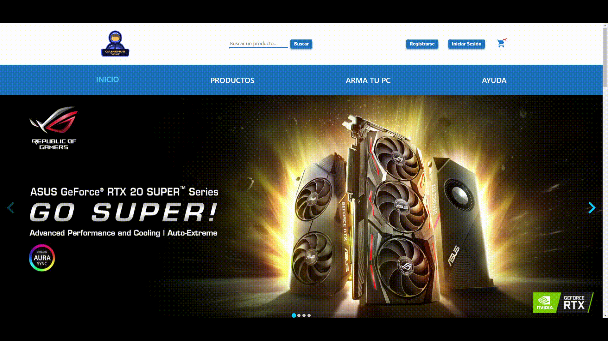

<h1 align="left"Hello beautiful people!</h1>

###

My name is WHAT!! My name is WHO! My name is chika chika Rodrigo Moriconi 🎈, and I´m a full stack web developer

###

<h2 align="left">About me</h2>

###

###

  <h2 align="left">I work with a lot of different technologies, take a look!!🎃</h2>

###

  
  
  
  
  
  
  
  
  
  
  
  
  
  

###

  

###

Hello World!!

###

  

###

Hello World!!

###
